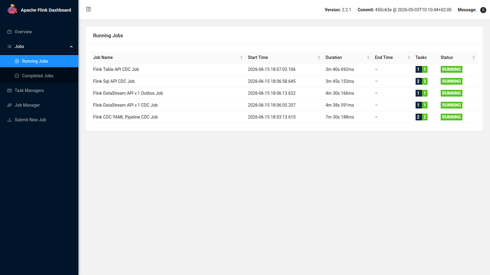
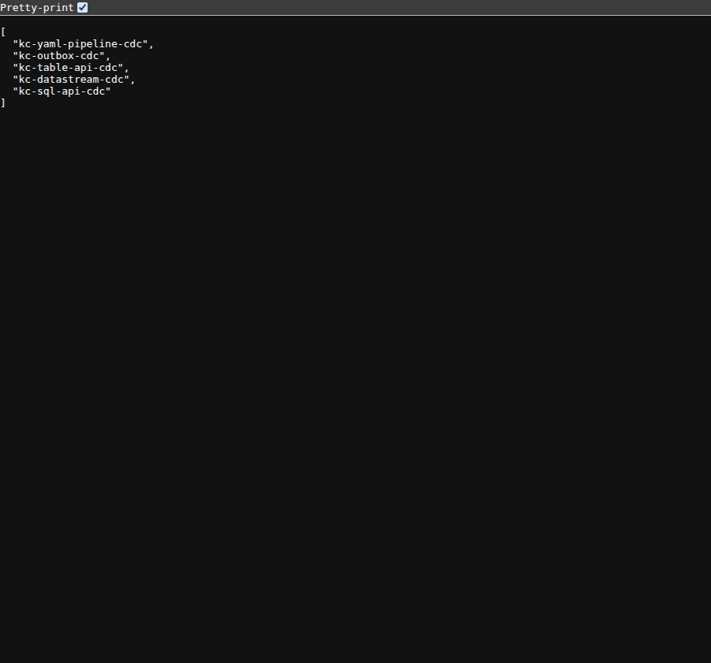
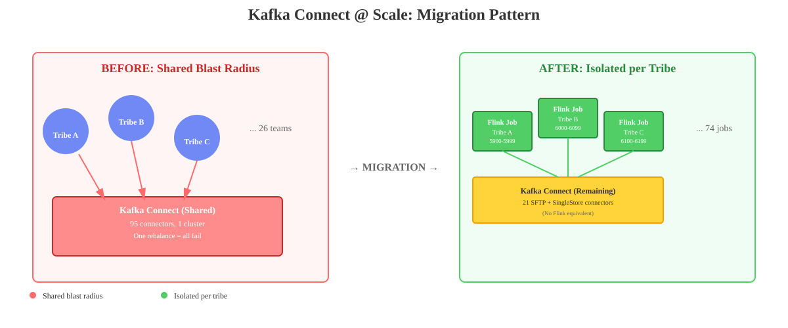
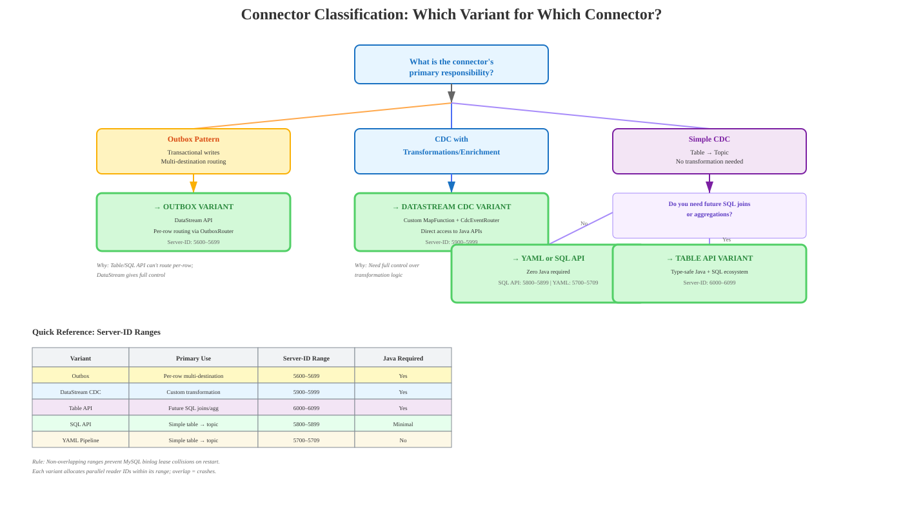
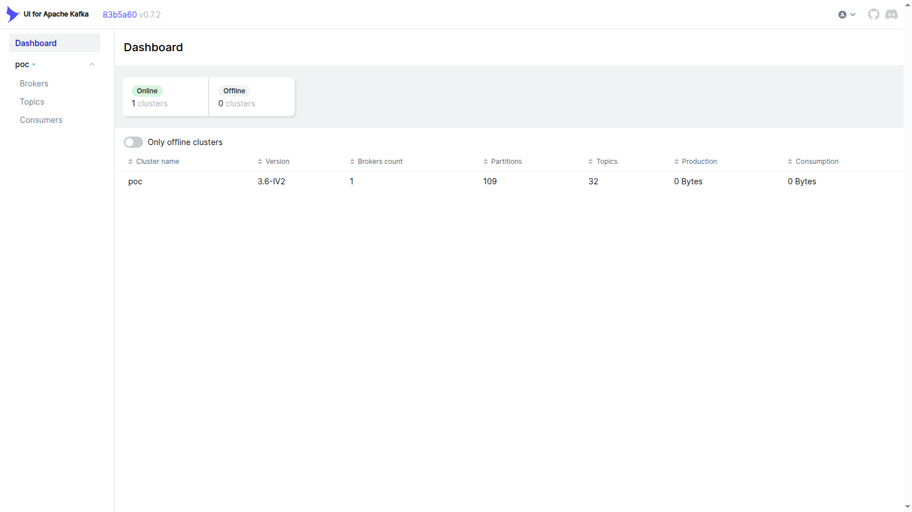
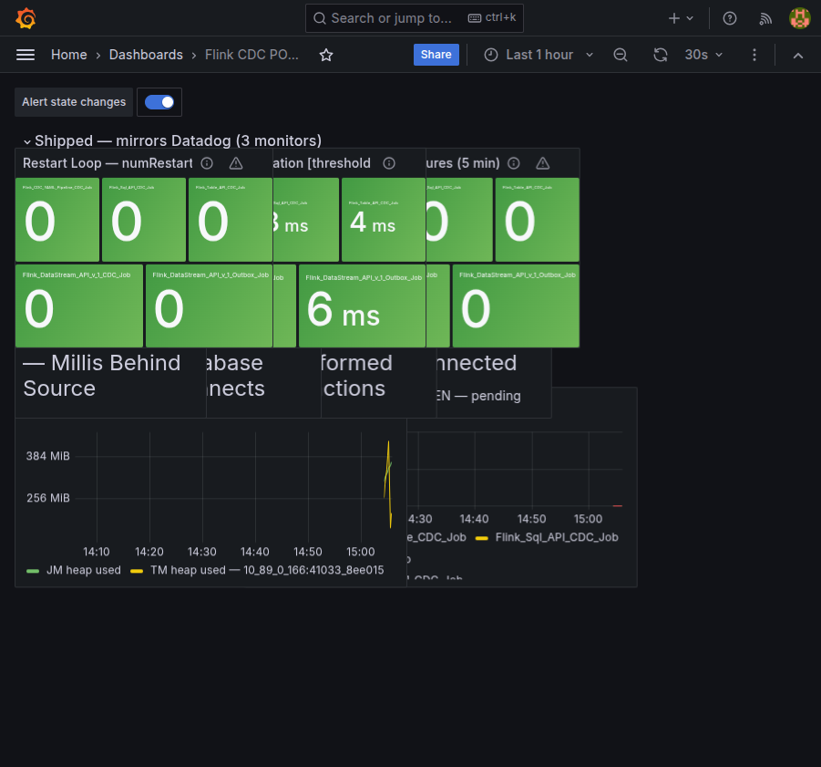
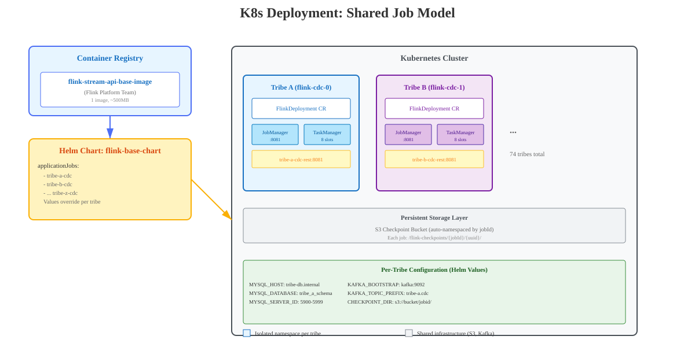

# Kafka Connect at Scale: The 74 Connectors Migration Case

**Author:** Adrian Balaban  
**Date:** 2026-06-26

In this session we'll explore Kafka Connect through the real experience of a client, focusing on a proof of concept and a proposed migration of 74 connectors from Confluent Kafka Cloud to Flink. We'll walk through the current challenges, the improvements the new approach targets, and the trade-offs involved. The talk also highlights the alternatives considered and the reasoning behind the proposed solution.

---

## Slide 0 — Why this talk is useful (what you'll be able to do after it)

> Not just a retelling of one client's migration — a **reusable playbook**. After
> this talk you can reproduce CDC with Kafka Connect or with Flink at another client.

Five things you take away from here:

1. **The client** — how a few years ago they started from a **DB-centric** architecture and reached an **event-driven** one by adding just Kafka and a number of Kafka Connect connectors. The context that makes the outcome relevant.
2. **The real production pain with KC** — cascading rebalances across unrelated teams, lag with no per-team tuning, a shared blast radius on a single cluster, Confluent Cloud licensing.
3. **Flink, Flink connectors, and Debezium in short** — what they are, where they overlap, where they differ; Debezium as a binlog parser reused internally by Flink CDC (not the same KC connector).
4. **Flink is fully event-driven** — not just a CDC connector, but a stateful stream-processing engine with event-time and exactly-once checkpoints, each job as an isolated K8s deployment.
5. **The info + POC code to do CDC at another client** — 5 variants running simultaneously, near-production-version code, reproducible Podman Compose and K8s infrastructure, component-tests that validate the Kafka output.

> Goal: at the end you can choose between KC and Flink with arguments — and you have code to start from, not from zero.

---

## Slide 1 — The Problem in One Sentence

> Real client. Real scale. 95 connectors, 26 teams, one shared cluster — and the question of whether Flink is the right way out.

The proposed migration of **74 MySQL connectors** from Confluent Kafka Cloud to Flink, with a proof of concept covering all 5 variants.

This talk is prepared for the **Cognizant Java Community Romania**.

---

## Slide 1b — Agenda (45 minutes)

*(Slides 0–1e form the opening frame (~6 min); the 45-minute block starts here.)*

1. **Where we are** (2 min) — The client context + migration goal: 95 connectors on a single cluster, of which 74 MySQL connectors, 21 stay on KC → *Slides 2–3*
2. **Why it's 'painful' and what we require** (5 min) — Challenges + the 3 requirements any solution must meet → *Slide 4*
3. **What Flink is and why it's the structural fix** (4 min) — Flink described in short; per-job isolation → *Slide 5*
4. **The POC + evidence** (10 min) — 5 Flink variants running simultaneously; a code snippet; the POC evidence table → *Slides 6–8*
5. **The proposed solution + improvements** (5 min) — The shared-job model; concrete improvements over today's challenges → *Slides 10–11*
6. **Architecture and collision avoidance** (8 min) — K8s deployment, server-ID ranges, monitoring → *Slides 12–13*
7. **The trade-offs** (5 min) — What changes, what stays → *Slide 14*
8. **The cost of change** (2 min) — TCO: what shrinks, what's added → *Slide 15*
9. **Open questions** (4 min) — 9 spikes → *Slide 16*

**Q&A: 15 minutes**

*(total agenda: 45 min + 15 min Q&A; the opening frame Slides 0–1e (~6 min: Slide 1c Kafka primer ~75 s, Slide 1d the CDC-vs-Outbox patterns ~3 min, Slide 1e POC overview ~1 min); the live screenshots in Slide 9 are shown only if time allows — none is included in the 45 min.)*

---

## Slide 1c — Context in ~75 seconds (for those who haven't worked with Kafka Connect & CDC)

```
MySQL binlog  →  Debezium  →  Kafka  →  consumers
               (captures       topics        (other systems,
                changes)                       DBs)
```

| Term | What it is (one sentence) |
|--------|------------------------|
| **MySQL binlog** | MySQL's internal log with all INSERT/UPDATE/DELETE — Debezium reads it and replicates it onto a Kafka topic |
| **Debezium** | Open-source CDC platform that reads the MySQL binlog and emits each INSERT/UPDATE/DELETE as a structured JSON event |
| **Kafka Connect** | The platform that runs Debezium (and other connectors) as managed workers |
| **SMT** | Single Message Transformer — a KC plugin that modifies each record in flight (enrichment, routing) |
| **Confluent Cloud** | Kafka + Kafka Connect as a managed service ([confluent.io/confluent-cloud](https://www.confluent.io/confluent-cloud/) — you don't run it, you pay for it) |
| **Apache Flink** | A stream-processing engine; can do the same thing as Debezium + KC, but as an isolated job on K8s |
| **StatementSet** | A Flink Table API construct that compiles several SQL operations over several tables into a single JobGraph (which has a single checkpoint) |
| **Outbox table** | A DB table written in the same transaction as the business record; CDC reads it and routes the event to the right Kafka topic — decouples event publishing from the main table |

> **Note:** all variants (except the outbox one) use the same thing — the MySQL binlog — and write to Kafka.
> The difference is *how* and *where* the reading process runs.

---
## Outbox Table — What Is It?

An outbox table is a database table used in the *outbox pattern*, in which the messages to be sent to other services or systems are stored. This approach ensures that publishing the message is part of the same transaction as the database update, maintaining data consistency and reliability.

*Sources: milanjovanovic.tech · microservices.io*

### Overview

An outbox table is an essential component in the outbox pattern, used predominantly in microservice architectures. It serves as a temporary storage area for messages that must be sent to other services or systems.

### Purpose of the outbox table

- **Data consistency:** the outbox table guarantees that publishing the message takes place in the same transaction as the database update. This atomicity prevents data inconsistency.
- **Reliable messaging:** by storing messages in the outbox table, the system can guarantee that messages are delivered at least once, even if the initial attempt fails.

### Structure of the outbox table

The outbox table usually includes the following columns:

| Column | Data type | Description |
|---------|-------------|-----------|
| `id` | UUID | Unique identifier for each message |
| `type` | VARCHAR(255) | The message type (e.g. the event type) |
| `content` | JSONB | The actual content of the message |
| `occurred_on_utc` | TIMESTAMP WITH TIME ZONE | The moment the message was created |
| `processed_on_utc` | TIMESTAMP WITH TIME ZONE | The moment the message was processed |
| `error` | TEXT | The error message in case processing fails |

### Benefits of using an outbox table

- **Atomic operations:** guarantees that both the database update and the message publishing are treated as a single operation, preventing partial failures.
- **Decoupling:** allows the message-sending process to be handled by a separate service, which can retry sending without affecting the main application flow.
- **Eventual consistency:** although the outbox pattern provides *at-least-once* delivery, it allows eventual consistency — that is, even though messages may be sent multiple times, the system can handle them gracefully.

---

## Slide 1d — Two Connector Patterns: CDC vs Outbox

Two fundamentally different ways a connector reads from MySQL and writes to Kafka.

### Pattern 1 — CDC: one topic per business table

```
┌──────────────────────── MySQL ────────────────────────────┐
│                                                           │
│  ┌────────────────┐       ┌──────────────────────────┐   │
│  │    orders      │       │       customers          │   │
│  ├────────────────┤       ├──────────────────────────┤   │
│  │ id │ amount│...│       │ id │ name │ email │  ... │   │
│  └────────────────┘       └──────────────────────────┘   │
│                                                           │
│         binlog — every INSERT / UPDATE / DELETE           │
└──────────────────────┬────────────────────────────────────┘
                       │ the connector follows the binlog
                       ▼
              ┌─────────────────┐
              │  CDC Connector   │
              │  (Flink / KC)    │
              └────────┬────────┘
                       │ one topic per captured table
          ┌────────────┴────────────┐
          ▼                         ▼
   ┌──────────────┐         ┌────────────────┐
   │ poc.flink    │         │ poc.flink      │
   │   .orders    │         │   .customers   │
   └──────────────┘         └────────────────┘
```

The connector captures the changes from each table. 

### Pattern 2 — Outbox: the application writes the intent; the connector routes by destination

```
┌────────────────────────────── MySQL ──────────────────────────────────────┐
│                                                                           │
│  ┌────────────────┐  same TX  ┌───────────────────────────────────┐   │
│  │    orders      │  ──COMMIT──▶ │         outbox_events             │   │
│  ├────────────────┤              ├───────────────────────────────────┤   │
│  │ id │ amount│...│              │ id │ destination │ payload │  ... │   │
│  └────────────────┘              │    │ "payments"  │ { ... } │       │   │
│                                  │    │ "fraud"     │ { ... } │       │   │
│                                  └───────────────────────────────────┘   │
│                                                                           │
│           binlog — the connector follows only outbox_events                │
└───────────────────────────────────┬───────────────────────────────────────┘
                                    │ routes by the destination field
                                    ▼
                          ┌──────────────────┐
                          │ Outbox Connector │
                          │  (Flink / KC)    │
                          └────────┬─────────┘
                                   │
              ┌────────────────────┼────────────────────┐
              ▼                    ▼                    ▼
       ┌────────────┐      ┌─────────────┐      ┌─────────────┐
       │  payments  │      │    fraud    │      │  analytics  │
       │   .events  │      │   .alerts   │      │    .feed    │
       └────────────┘      └─────────────┘      └─────────────┘
```

The application controls the shape of the event and the destination. The business table's schema never reaches consumers — only the crafted payload from the outbox row reaches Kafka.

> **The key difference:** CDC exposes each table's changes as they are (one topic per table; schema drift propagates).
> Outbox gives the application full control over the event's shape and the destination topic — a single outbox table → multiple topics, routed by the `destination` field written at INSERT.

---

## Slide 1e — What the POC Contains (Overview)

**The POC demonstrates 5 Flink CDC variants + 5 equivalent Kafka Connect connectors, running simultaneously on the same local stack (podman-compose and K8s).**

| Flink Dashboard — 5/5 jobs RUNNING | Kafka Connect REST — 5 connectors |
|---|---|
|  |  |

                ┌──────────────────────── MySQL (poc_db) ─────────────────────────┐
                │   orders · customers · outbox_events   —   binlog ROW / FULL     │
                └─────────────────────────────┬───────────────────────────────────┘
                                              │  THE SAME binlog, read by both engines
                  ┌───────────────────────────┴───────────────────────────┐
                  ▼                                                         ▼
        ╔═══════════════════════════╗                       ╔═══════════════════════════╗
        ║       KAFKA CONNECT       ║                       ║       APACHE FLINK        ║
        ║   Debezium · workers      ║                       ║   Flink CDC · 1 job =     ║
        ║   on 1 shared cluster     ║                       ║   1 isolated K8s deployment ║
        ║   topics:  poc.kc.<x>     ║                       ║ topics: poc.flink.<x>..   ║
        ╚═════════════╤═════════════╝                       ╚═════════════╤═════════════╝
                      │            the same 5 patterns, two implementations    │
                      └───────────────────────────┬───────────────────────┘
                                                  ▼
┌───┬──────────────────┬──────────────────────┬──────────────────────────────────┐
│ # │ Variant (pattern) │ Kafka Connect        │ Apache Flink                     │
├───┼──────────────────┼──────────────────────┼──────────────────────────────────┤
│ 1 │ DataStream API   │ 5510 · datastream    │ 5900–5999 · datastream.orders    │
│ 2 │ Table API        │ 5520 · table-api     │ 6000–6099 · table-api.orders     │
│ 3 │ SQL API          │ 5530 · sql-api       │ 5800–5899 · sql-api.orders       │
│ 4 │ Outbox           │ 5550 · outbox        │ 5600–5699 · outbox.outbox-events │
│ 5 │ YAML Pipeline    │ 5540 · yaml-pipeline │ 5700–5709 · yaml-pipeline.orders │
└───┴──────────────────┴──────────────────────┴──────────────────────────────────┘

  The engine columns show:  server-ID  ·  the Kafka topic suffix
  KC    → poc.kc.<suffix>                 (a single topic per connector)
  Flink → poc.flink.<suffix>              (isolated job, exactly-once checkpoint)
  Total: 5 patterns × 2 engines = 10 CDC implementations running simultaneously on the same MySQL.

> Both 'engines' (KC and Flink) run in parallel for comparison (input and output). The complete screenshots and details in Slide 9.

---

## Slide 2 — The Client Context (Where We Are Today)

```
26 teams  ─►  ┌───────────────────────────────┐
              │  1 shared KC cluster          │
              │  95 connectors (74 MySQL + 21) │  blast radius = 1
              │  1 rebalancing group          │
              └───────────────────────────────┘
```

**Real experience with a client: Confluent Kafka Cloud at scale**

- **95 connectors** on **a single shared Kafka Connect cluster** for **26 teams**
- Two connector families today:
  - **Debezium (Kafka Connect)** — reads the MySQL binlog via KC managed by Confluent, one event per change per topic
  - SFTP + SingleStore sink/source connectors
- Everything shares a single cluster: one configuration, a single rebalancing group, a single blast radius

> The shared cluster was convenient at 5 connectors. At 95 across 26 teams — and
> growing — it is the biggest source of cross-team incidents. This scaling
> pressure is why we're investigating now.

---

## Slide 3 — The Goal of the Migration

**What we migrate:** 74 MySQL connectors → Apache Flink MySQL CDC Connector

**What stays on Kafka Connect:** 21 SFTP + SingleStore connectors (Flink has no equivalent)



---

## Slide 4 — What's 'painful' Today and What We Require of Any Solution


**What's 'painful' today — and what the costs are:**

| Problem | Who | How often | Business impact |
|----------|------|-----------|-----------------|
| 'Rebalancing storms' — one defective connector destabilizes everything | All 26 teams | Several times/quarter | Cross-team incidents; consumer downtime |
| Shared 'blast radius' — 95 connectors, one cluster | All 26 teams | On every incident | No isolation between teams |
| Recurrent 'lag' — no 'per team' tooling | Team + consumers | Continuous | SLA risk on downstream consumers |
| Errors that surface only when deploying new connectors and only in production | When new connectors are added | Rare lately | Errors reaching prod undetected |
| Confluent Kafka Cloud licensing | The organization | Monthly | **Significant monthly licensing cost** (it's per cluster node, see Slide 15 TCO) |
| Confluent security patches only every 3 months | The KC maintenance team | On every release cycle and every fixed vulnerability | Risk of errors in patches made by the KC maintenance team |

**What a "rebalancing" is in Kafka Connect**
A Kafka Connect cluster is a group of workers that share connectors and their tasks among themselves. This distribution is coordinated by Kafka's group membership protocol. Whenever something changes — a worker joins/leaves, you add/modify/delete a connector, a task crashes — the cluster triggers a rebalance: it recalculates "who runs which task" and redistributes the work across all workers.

Why it's "1 group":
Because all 95 connectors of the 26 teams sit on a single shared cluster, they belong to the same rebalancing group — a single coordination group. There is no isolation: you can't "rebalance" only team A's connectors without touching the rest.

Why it matters (this is the point of the slide):
With the classic rebalance protocol ("eager" / stop-the-world), a rebalance temporarily stops ALL tasks across the entire cluster and reassigns them. So a single change/a single defective connector from one team → triggers a rebalance that pauses the connectors of all 26 teams at the same time.


**What we require of any solution** *(solution-agnostic — the benchmark for the options on the Decision Matrix below):*

1. The base image + security patches remain **centralized** — teams don't own the runtime.
2. **To move away from Confluent Platform** — licensing and lock-in.
3. **Splitting into per-team clusters, with the same solution, doesn't solve the problems**.


**Decision Matrix: Which Variant for Which Connector Type?**



| Connector Type | Recommended Variant | Why |
|-------------------|--------------------|----|
| Outbox (transactional, per-row routing) | DataStream | Table/SQL API can't do per-row routing |
| CDC with custom enrichment/transformation | DataStream CDC | Java access to `CdcEventRouter` + custom `MapFunction` |
| Simple CDC (table → topic, no transformation) | YAML Pipeline/SQL API | Zero Java |
| CDC with future SQL joins/aggregations | Table API | Simplifies the system |

---

## Slide 5 — What Flink Is and Why It's the Proposed Structural Fix

**Apache Flink** is a stateful stream-processing engine: a continuous job that reads events, maintains state, and writes results — with **exactly-once checkpoints** (durable, recoverable). Each job runs as **its own isolated K8s deployment** (its own JobManager + TaskManager) under the Flink Operator.

**Flink + MySQL Connector** as well as **Flink CDC** do the same thing as Debezium-on-Kafka-Connect — read the MySQL binlog and emit CDC events to Kafka.

The structural argument in a single frame — this is the bridge from "what's 'painful'" to "why Flink fixes it":

> **"CDC" means two things — don't confuse them:** (1) **Flink CDC `MySqlSource`** — the connector that reads the MySQL binlog through Flink CDC's own incremental snapshot algorithm (variants 1–4: DataStream / Table API / SQL API / Outbox; internally reuses the Debezium binlog parser, but does **not** run on the Debezium Kafka Connect connector). (2) **Flink CDC YAML pipeline** — the *declarative YAML pipeline framework* on top of the same source, with no Java (Variant 5). This talk covers both senses.

| | Kafka Connect today | Flink (proposed) |
|--|--|--|
| Deployment | 1 shared cluster of workers | N isolated K8s jobs (via Flink Operator) grouped per team |
| Blast radius | 1 — all 95 connectors | 1 per team — limited |
| Rebalancing storms | one group → cascade across 26 teams | none |
| Licensing | Confluent Cloud (paid) | Apache 2.0 (free) |

---

## Slide 6 — The POC: Five Flink Variants

Since Flink has 4 APIs plus Flink CDC (pipeline configured with yaml), we built **5 variants** that are run **simultaneously**.

| # | Variant | Main Class Size | Output Format | Java Required? |
|---|---------|-----------|---------------|---------------|
| 1 | CDC with Flink DataStream API | 63 lines | Debezium envelope + enrichment | Yes |
| 2 | CDC with Flink Table API | 99 lines | Flattened row (upsert-kafka) | Yes |
| 3 | CDC with Flink SQL API | 156 lines | Flattened row (upsert-kafka) | Minimal |
| 4 | CDC with Flink CDC (YAML Pipeline) | 52 lines YAML | native Debezium envelope | **No** |
| 5 | Outbox with Flink DataStream API | 56 lines | Debezium envelope of the outbox row (single topic; per-destination routing is production, not in the POC) | Yes |

> All four API variants additionally share ~412 lines of `common/` infrastructure (`JobConfig`, `CheckpointConfigurer`, deserializer, KafkaSinkFactory routers) — the entry classes contain only the variant-specific code.

---

## Slide 7 — The Java Programmer's Perspective: Code Comparison

### CDC with DataStream API (63-line entry class, maximum control)

```java
MySqlSource<String> source = MySqlSource.<String>builder()
    .hostname(config.mysqlHost).port(config.mysqlPort)
    .databaseList(config.mysqlDatabase).tableList(config.mysqlTables)
    .username(config.mysqlUser).password(config.mysqlPassword)
    .serverTimeZone("UTC")
    .serverId(config.serverId)
    .deserializer(new PocJsonDeserializationSchema())
    .build();

env.fromSource(source, WatermarkStrategy.noWatermarks(), "MySQL CDC Source")
   .process(new CdcEventRouter(config))
   .sinkTo(KafkaSinkFactory.create(config, "datastream"));
```

> All connection details come from `JobConfig.fromEnv()` — nothing is hardcoded.

### YAML Pipeline (52 lines, zero Java)

```yaml
source:
  type: mysql
  hostname: ${MYSQL_HOST}
  port: ${MYSQL_PORT}
  username: ${MYSQL_USER}
  password: ${MYSQL_PASSWORD}
  tables: ${MYSQL_DATABASE}.orders
  server-id: 5700-5709
sink:
  type: kafka
  properties.bootstrap.servers: ${KAFKA_BOOTSTRAP}
  topic: ${KAFKA_TOPIC_PREFIX}.yaml-pipeline.orders
pipeline:
  name: Flink CDC YAML Pipeline CDC Job
```

---

## Slide 8 — POC Evidence
| Check | Result |
|-------------|--------|
| Unit tests | 57/57 passed |
| All 8 modules compile | Clean |
| Formatting (Spotless — Google Java Format) | Compliant |
| Flink CDC 3.6.0 on Flink 2.2 | Verified |
| Unit Tests on each variant | Passed 100% coverage JaCoCo 100% mutations |
| Local integration test | Passed (5 Flink variants + 5 KC) |
| Component Tests on each variant | Passed (5 Flink variants + 5 KC) |
| StatementSet → 1 JobGraph | Verified (only SQL API; Table API uses a single INSERT, not a StatementSet) |
| All 5 variants run in parallel | Running at POC scale (localhost:8081; incremental RocksDB state) |
| Local integration tests (Flink MiniCluster) | Passed (DataStreamCdc, OutboxRouter) |
| Checkpoints persisted to S3/MinIO (as in production) | Verified — `flink-checkpoints` bucket, same code config (30 s interval, EXACTLY_ONCE) |

---

## Slide 9 — POC Evidence: Live Screenshots

**All 5 Flink variants running simultaneously on localhost — captured during the live POC.**
*The access URLs for each screenshot are in `kafka-connect-at-scale-appendix.md` → the **Local Monitoring Endpoints** section.*

### Flink Dashboard — 5/5 Jobs RUNNING


> All five CDC variants (DataStream, Table API, SQL API, Outbox, YAML Pipeline) active in a single
> Flink cluster. Each has its own MySQL server-ID range; zero collisions.

### Kafka UI — poc cluster (32 topics, 109 partitions)



> Topics are created automatically by the CDC connectors. 32 topics = one topic per table for all 5 variants
> plus schema-history topics. The signal topics (`private.debezium.signal.*`) are specific to KC;
> Flink CDC doesn't use them.

### Kafka Connect REST API — 5 KC Connectors (side-by-side comparison)


> The KC connectors run in parallel only to compare the output. Server-IDs in the reserved range
> `5500–5599` to avoid collision with the Flink variants.

### Grafana Dashboard — Flink CDC POC Monitoring



> 3 monitors delivered (mirroring Datadog): Restart Loop, Checkpoint Duration, Checkpoint Failures — all 5 variants green (green = OK). Monitors #4–#7 (connector lag, snapshot state, binlog position) pending Spike S1.

---
## Slide 10 — The Recommended Architecture (The K8s Deployment Model)

**One base image per variant. 74 MySQL connectors. No Java code used by teams.**

The Flink Platform Team 'owns' and 'publishes' parameterized Docker images for the 5 variants, kept up to date for vulnerabilities.
Each team 'owns' and configures its connectors, in its own repo, just by overriding Helm values.



```yaml
# Everything a team needs
applicationJobs:
  my-tribe-cdc1:
    image: flink-stream-api-base-image:1.0.0
    extraEnvs:
      MYSQL_HOST: my-db.internal
      MYSQL_DATABASE: my_schema
      KAFKA_TOPIC_PREFIX: my-tribe.cdc
```

---
## Slide 11 — Improvements

| Challenge (Slide 4) | Improvement |
|---------------------|--------------|
| Rebalancing storms — one defective connector destabilizes everything | **isolated blast radius** — each team's Flink job is isolated; failure stays per-team |
| shared blast radius — 95 connectors, a single cluster | **Clear ownership** — the team owns the repo and the deploy cadence of their connector |
| Recurrent lag — no per-team lever | **Lag is managed per team and per-job** |
| Failures only in production | **Native Kubernetes lifecycle** — Flink Operator; local component tests catch problems before deploy |
| Confluent licensing | **Partial licensing savings** — 74 connectors moved off the KC cluster, so it can be reduced to fewer billable cluster nodes; 21 SFTP/SingleStore connectors stay on KC |
| Fleet-wide coordinated upgrades | **Independent upgrades** — per-job versioning; no fleet-wide coordination |

> **Note:** The exactly-once sink requires Kafka transactions (`DeliveryGuarantee.EXACTLY_ONCE` + transactional ID prefix in `KafkaSinkFactory`); the Kafka broker must have transactions enabled.

---

## Slide 12 — Collision Avoidance

Each POC variant gets its own dedicated, non-overlapping range on 4 axes, so all can run simultaneously without collisions:

- **MySQL server-ID range** — so parallel Flink CDC readers don't steal each other's binlog lease
- **MySQL schema** — so each variant has its own source database
- **Kafka topic prefix** — so topics don't overlap
- **S3 checkpoint paths** — so checkpoints don't overlap

| Axis | Allocation |
|------|------------|
| MySQL server-ID | outbox=5600–5699, pipeline=5700–5709, sql-api=5800–5899, cdc=5900–5999, table-api=6000–6099 |
| MySQL schema | `cdc_db`, `sql_api_db`, `table_api_db`, `pipeline_db`, `outbox_db` |
| Kafka topic prefix | `shared-cdc.cdc-db.*`, `sql-api.sql-api-db.*`, `table-api.table-api-db.*`, `pipeline.pipeline-db.*`, `outbox.destination.*` |
| S3 checkpoint paths | Auto-namespaced by `jobId` — shared bucket, safe |

> **Why ranges, not unique IDs?** Flink allocates IDs for 'parallel readers'. A single identifier collides on restart because the previous MySQL binlog lease hasn't expired.

---

## Slide 13 — Centralized Monitoring: KC and Flink

| | Now (KC / Debezium JMX) | Gap | Target (Flink, post-S1) |
|--|--------------------------|-----|------------------------|
| **Connector lag** | Debezium JMX `debezium.mysql:type=connector-metrics` → `MillisSinceLastEvent` | No direct Flink equivalent | Flink source backlog metric (S1 investigation) |
| **Snapshot State** | Debezium JMX `snapshot.running` / `snapshot.aborted` | No equivalent yet (Spike S4) | Flink job status + custom metric via S1/S4 |
| **Binlog position** | Debezium JMX `source.pos` | No direct equivalent | Binlog position check from MySQL or Flink offset metric (S1) |
| **Restarts** | Kafka Connect worker restarts | ✅ Available — Flink `numRestarts` (Prometheus + Datadog) | Same |
| **Checkpoint Health** | N/A (stateless KC) | ✅ Improvement — Flink `lastCheckpointDuration`, `numberOfFailedCheckpoints` | Same |

**The Datadog monitors #4–#7** (connector lag, snapshot state, binlog position, snapshot abort) can't be mapped directly until Spike S1 resolves the Flink metric equivalents.

**Interim mitigation (pre-S1):**
- Monitor `numRestarts` as a proxy for lag (repeated restarts → stale binlog position)
- From MySQL: `SHOW MASTER STATUS` query + comparison with the last Flink binlog offset from checkpoint metadata
- Alert on Flink source `records.consumed.rate` dropping to 0

**Target state:** A Terraform repo with:
- a shared module for the Flink monitors ('owned by Flink Platform Team')
- one module per team ('owned by' the team) that instantiates these monitors and configures them via each team's `config.tf`.

---

## Slide 14 — Trade-offs and Risks
| Risk | Status / Mitigation | Where it's addressed |
|------|-------------------|-------------------|
| KC remains for 21 SFTP/SingleStore connectors — two systems to operate | To Accept; SFTP/SingleStore have no Flink equivalent | Slide 3 (goal), Slide 15 (TCO) |
| Learning curve — Flink Operator, checkpoints, savepoints | Mitigated for most teams by the shared-job model | Slide 10 (shared-job) |
| Cutover sequencing — no val plan, dual-run, parity gate or rollback runbook yet | **Unmitigated** — S6 must deliver: val plan, dual-run period, byte-for-byte parity gate, binlog server-ID overlap coordination, rollback runbook | Slide 16, Spike S6 |
| New operational surface — Flink Operator, checkpoints, savepoints | Mitigated by Flink Platform Team ownership of the base image and monitoring module | Slide 13, Spike S1 |
| Observability regression — Debezium JMX metrics (lag, snapshot state, binlog position) have no direct Flink equivalent | **Unmitigated** — interim: Flink restart/backlog metrics + binlog-position checks from MySQL as a lag proxy; full resolution pending Spike S1 | Slide 13, Spike S1 |
| Schema evolution (ALTER TABLE) — behavior differs per variant; downstream Kafka schema compatibility unvalidated | **Unmitigated** — no dbhistory.* equivalent; per-team validation + schema-registry compatibility policy | Slide 16, Spike S8 (new) |

---

## Slide 15 — Total Cost of Ownership (High Level)

**Current state (Confluent KC):** a single shared-cluster bill covers all 95 connectors.

**Proposed state (Flink):** reduced Confluent bill — only 21 connectors stay on KC, so the cluster can run on fewer nodes; Flink runs on existing K8s with no additional licenses.

| Cost axis | KC today (95 connectors) | Flink proposal (74 CDC → Flink; 21 KC stay) |
|-------------|----------------------|------------------------------------------------|
| Confluent licensing | Full bill for 95 connectors | ~22% connectors retained (21/95); fewer connectors → smaller cluster → fewer billable cluster nodes — see note |
| Compute (K8s CPU/RAM) | KC managed by Confluent (included in license) | One JM + TM pair per connector; size per team against peak load change rate (POC estimate: ~0.5 vCPU + 1 GB RAM at low binlog throughput; production sizing pending Spike S2) |
| Operational overhead | Centralized shared-cluster ops | Per-team isolation; Flink Platform Team owns the base image |
| Per-team migration cost | Zero (status quo) | The S5/S6 spike deliverables (cutover automation) |

> **Note:** the Confluent price per cluster node depends on the contract tier.
> The directional saving (74 connectors moved off the KC cluster, allowing it to run on fewer nodes) is certain;
> the K8s compute increase must be sized against the existing KC worker fleet.

---

## Slide 16 — Open Spikes

| ID | Topic | Why It Matters | Phase | Timebox |
|----|-------|---------------|------|---------|
| S1 | Flink metric parity — Debezium JMX metrics via Flink? | Determines the monitoring module design; blocks mapping KC monitors #4–#7 | Phase 0 | 3 days |
| S2 | Memory pressure on initial snapshot of the largest table | Prevents surprises in Phase 1/2 | Phase 0 | 2 days |
| S3 | Multi-topic outbox routing at scale (POC tests at 2) | Blocker for Phase 1 go-live | Phase 0 | 2 days |
| S4 | Flink equivalent for `snapshot.aborted`/`snapshot.running` | Outbox-connector migration (Phase 3) | Phase 0 | 2 days |
| S5 | Staging testing (RDS IAM, binlog leases, IRSA rotation) | The POC can't expose these | Phase 1 | ≥7 days soak test in staging |
| S6 | Cutover automation (KC → Flink): val plan, dual-run period, byte-for-byte parity gate, binlog server-ID overlap coordination, rollback runbook | No cutover plan exists yet; manual switches won't scale to 26 teams | Phase 2 | ~5 days ? |
| S7 | Claude self-service migration tooling for teams | Teams can't wait for Flink Platform Team assistance | Phase 1 | 3 days ? |
| S8 | Schema evolution — ALTER TABLE behavior per Flink variant; no dbhistory.* equivalent; schema-registry compatibility policy | Per-team 'blast radius' for schema changes; what's the daily production reality? | Phase 0 | 2 days ? |
| S9 | Client Re-snapshot — savepoint + S3 checkpoint deletion + re-run with `--fromSavepoint` via Flink Operator; binlog lease risk | The official stateful upgrade path; without it, any restart re-snapshots the whole table (FLINK_SAVEPOINT_RUNBOOK.md) | Phase 0 | 2 days |

**Total Phase 0 (S1–S4, S8, S9): ~13 days of engineering — parallelizable into a single sprint?**

**Phase legend:** 0 = spikes (pre-pilot) · 1 = pilot go-live first team · 2 = expansion · 3 = cutover

---

## References

- [Apache Flink 2.2.0 documentation](https://nightlies.apache.org/flink/flink-docs-release-2.2/)
- [Apache Flink CDC 3.6 documentation](https://nightlies.apache.org/flink/flink-cdc-docs-release-3.6/)
- [Apache Flink CDC project homepage (GitHub)](https://github.com/apache/flink-cdc)
- [Debezium MySQL Connector documentation](https://debezium.io/documentation/reference/stable/connectors/mysql.html)
- [Kafka Connect overview (Apache Kafka documentation)](https://kafka.apache.org/documentation/#connect)
- [Confluent Kafka Connect documentation](https://docs.confluent.io/platform/current/connect/index.html)
- [Confluent Debezium MySQL CDC Source Connector](https://docs.confluent.io/cloud/current/connectors/cc-mysql-cdc-source-debezium.html)
- [Flink DataStream API documentation](https://nightlies.apache.org/flink/flink-docs-release-2.2/docs/dev/datastream/overview/)
- [Flink Table API documentation](https://nightlies.apache.org/flink/flink-docs-release-2.2/docs/dev/table/overview/)
- [Flink SQL API documentation](https://nightlies.apache.org/flink/flink-docs-release-2.2/docs/dev/table/sql/overview/)
- [Confluent Cloud documentation](https://docs.confluent.io/cloud/current/overview.html)
- [Flink Kubernetes Operator documentation](https://nightlies.apache.org/flink/flink-kubernetes-operator-docs-main/)
- [Apache Flink documentation (stable)](https://nightlies.apache.org/flink/flink-docs-stable/)
- [Flink Kubernetes Operator documentation (stable)](https://nightlies.apache.org/flink/flink-kubernetes-operator-docs-stable/)
- [Apache Flink CDC documentation (stable)](https://nightlies.apache.org/flink/flink-cdc-docs-stable/) 
- [Flink CDC MySQL Connector documentation](https://nightlies.apache.org/flink/flink-cdc-docs-release-3.6/docs/connectors/flink-sources/mysql-cdc/)
- `FLINK_CHECKPOINT_CONFIG.md` — checkpoint semantics, monitoring, troubleshooting
- `FLINK_SAVEPOINT_RUNBOOK.md` — safe upgrade workflows, state recovery
- `KAFKA_CONNECT.md` — KC CDC variants, SMTs, Flink vs KC comparison
- `HOW-TO-RUN-THIS-POC.md` — how to run this POC