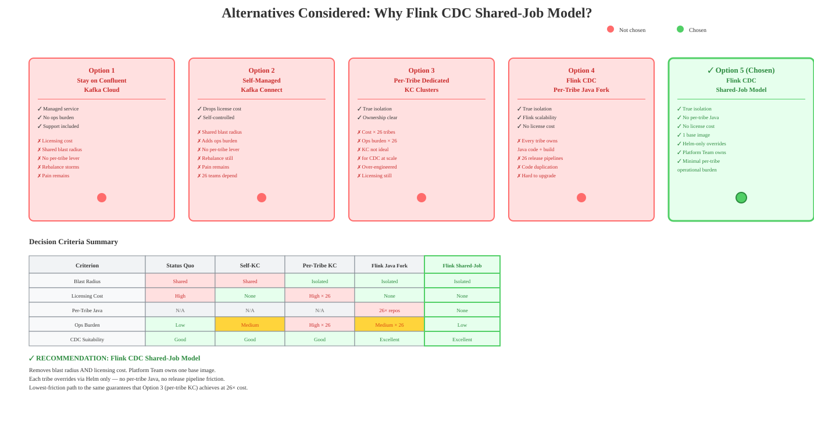
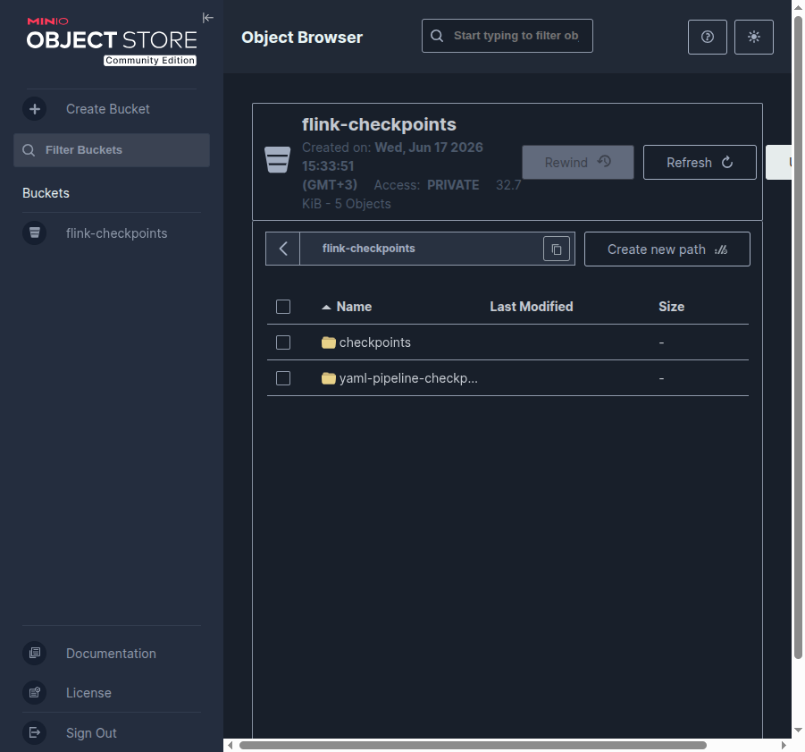

# Kafka Connect @ Scară: Cazul Migrării a 74 de Conectori

**Autor:** Adrian Balaban  
**Data:** 2026-06

---

## Slide 1 — Abstract

**Kafka Connect @ Scară: Cazul Migrării a 74 de Conectori**

În această sesiune, vom explora Kafka Connect prin experiență reală cu un client,
concentrându-ne pe migrarea propusă a **74 de conectori MySQL** (din 95 în total) **de la Confluent Kafka Cloud la Flink** și un proof of concept.

Vom parcurge provocările actuale, ce îmbunătățiri vizează noua abordare
și compromisurile implicate. Prezentarea evidențiază totodată
**alternativele luate în considerare** și **raționamentul din spatele soluției propuse**.

> Client real. Scară reală. 95 de conectori, 26 de echipe, un cluster partajat — și
> întrebarea dacă Flink este calea de ieșire corectă.

---

## Slide 1b — Agendă (45 de minute)

1. **Unde suntem** (2 min) — Contextul clientului, 95 de conectori pe un singur cluster
2. **De ce doare și ce cerem** (4 min) — Provocări + cele 3 cerințe pe care orice soluție trebuie să le îndeplinească
3. **Ce este Flink și de ce este remedierea structurală** (3 min) — Flink CDC într-un cadru; pool partajat vs. izolare per-job
4. **POC-ul** (8 min) — 5 variante Flink rulând simultan; un snippet de cod
5. **Soluția** (5 min) — Modelul shared-job: o imagine, overrides doar prin Helm per echipă
5b. **Costul schimbării** (2 min) — TCO: ce nu mai plătești, ce adaugi
6. **Arhitectură și evitarea coliziunilor** (7 min) — Deployment K8s, intervale server-ID, monitorizare
7. **Compromisurile** (4 min) — Ce se schimbă, ce rămâne, suprafața operațională nouă
8. **De ce aceasta față de alternative** (5 min) — Matrice de decizie: de ce Flink CDC vs KC vs altele
9. **Întrebări deschise** (3 min) — 7 spike-uri

**Q&A: 15 minute**

---

## Slide 1c — Context în 30 de secunde (pentru cei care nu au lucrat cu Kafka)

```
MySQL binlog  →  Debezium  →  Kafka  →  consumatori
               (capturează     (magistrala     (alte sisteme,
                schimbări)      de mesaje)       DB-uri)
```

| Termen | Ce este (o propoziție) |
|--------|------------------------|
| **MySQL binlog** | Jurnalul intern MySQL cu toate INSERT/UPDATE/DELETE — Debezium îl citește ca un replica |
| **Debezium** | Bibliotecă open-source care transformă binlog-ul în evenimente JSON |
| **Kafka Connect** | Platforma care rulează Debezium (și alți conectori) ca workere gestionate |
| **Confluent Cloud** | Kafka + Kafka Connect ca serviciu managed (nu îl administrezi tu, îl plătești) |
| **Apache Flink** | Motor de procesare a stream-urilor; poate face același lucru ca Debezium + KC, dar ca job izolat pe K8s |

> **De reținut:** toate variantele din acest talk citesc același lucru — binlog-ul MySQL — și scriu în Kafka.
> Diferența este *cum* și *unde* rulează procesul de citire.

---

## Slide 2 — Contextul Clientului (Unde Suntem Azi)

**Experiență reală cu un client: Confluent Kafka Cloud la scară**

- **95 de conectori** pe **un singur cluster Kafka Connect partajat** pentru **26 de echipe**
- Două familii de conectori astăzi:
  - **Debezium (Kafka Connect)** — citește binlog-ul MySQL via KC gestionat de Confluent, un eveniment per modificare per topic
  - Conectori sink/source SFTP + SingleStore
- Totul partajează un singur cluster: o configurație, un singur grup de rebalansare, o singură rază de impact

> Clusterul partajat era convenabil la 5 conectori. La 95 pe 26 de echipe — și
> în creștere — este singura sursă majoră de incidente inter-echipe. Această
> presiune de scalare este motivul pentru care investigăm acum.

---

## Slide 3 — Ce Cerem și Ce Doare Azi

**Ce cerem de la orice soluție** *(Kafka Guild, agnostic față de soluție — etalonul pentru opțiunile de pe slide-ul Alternative):*

1. Imaginea de bază + patch-urile de securitate rămân **centralizate** — echipele nu dețin runtime-ul.
2. **Să ne îndepărtăm de Confluent Platform** — licențiere și lock-in.
3. **Clusterele per echipă nu rezolvă proprietatea** — înmulțesc costul de 26× fără a remedia cauza root.

**Ce doare azi — și cât costă:**

| Problemă | Cine | Cât de des | Impact business |
|----------|------|-----------|-----------------|
| Furtuni de rebalansare — un conector defect destabilizează toți | Toate cele 26 de echipe | De mai multe ori/trimestru | Incidente inter-echipe; downtime consumatori în timpul cascadei |
| Raza de impact partajată — 95 de conectori, un cluster | Toate cele 26 de echipe | La fiecare incident | Fără izolare între echipe |
| Lag recurent — niciun reglaj per echipă | Echipa + consumatori | Continuu | Risc SLA pe consumatorii downstream |
| Eșecuri doar în producție — se manifestă abia după deploy | Echipele cu conectori noi | La fereastră conector nou | Defecte ajung în prod nedetectate |
| Licențiere Confluent Kafka Cloud | Organizația | Lunar | **Cost lunar de licențiere semnificativ** |
| Patch-uri de securitate centralizate | Echipa de mentenanță | La fiecare ciclu de release | Overhead de coordonare la nivel de flotă |

> Un singur restart de conector declanșează o **rebalansare în cascadă între echipe fără legătură** — și fiecare rând de mai sus corespunde unei îmbunătățiri concrete (vezi slide-ul Îmbunătățiri).

---

## Slide 4 — Ce Este Flink și De Ce Este Remedierea Structurală

**Apache Flink** este un motor de procesare a stream-urilor cu stare (stateful): un job continuu care citește evenimente, menține stare și scrie rezultate — cu **checkpoint-uri exactly-once** (durabile, recuperabile) și semantici **event-time**. Fiecare job rulează ca **propriul deployment K8s izolat** (JobManager + TaskManager proprii) sub Flink Operator.

**Flink CDC** este conectorul care face același lucru ca Debezium-pe-Kafka-Connect — citește binlog-ul MySQL și emite evenimente de schimbare în Kafka — dar cu un algoritm de **incremental snapshot** care nu necesită **niciun topic partajat de offset și nici topic de semnal**, rulând în interiorul acelui job izolat.

Argumentul structural într-un singur cadru — aceasta este puntea de la "de ce doare" la "de ce Flink remediază":

| | Kafka Connect azi | Flink (propus) |
|--|--|--|
| Deployment | 1 cluster partajat de workere | N joburi K8s izolate (Flink Operator) |
| Raza de impact | 1 — toate cele 95 de conectori | 1 per echipă — limitată |
| Rebalansare | un grup → cascadă pe 26 de echipe | niciuna — fără grup partajat |
| Offset-uri / stare | topic partajat de offset | checkpoint-uri exactly-once per job (S3) |
| Licențiere | Confluent Cloud (cu plată) | Apache 2.0 (gratuit) |

> **"CDC" înseamnă două lucruri — nu le confunda:** (1) **Debezium CDC** — la nivel de tabel, citește binlog-ul MySQL, un eveniment per schimbare per topic (rulează atât pe KC cât și pe Flink). (2) **Flink CDC** — *framework-ul declarativ de pipeline YAML* deasupra acelui flux (fără Java). Această prezentare acoperă ambele; Varianta 5 este "Flink CDC" în sensul (2). *(Aceasta este cea mai frecventă sursă de neînțelegere la revizuirea acestei lucrări — Propunerea A §2.)*

---

## Slide 5 — Scopul Migrării

**Ce migrăm:** 74 de conectori MySQL → Apache Flink MySQL CDC Connector

**Ce rămâne pe Kafka Connect:** 21 de conectori SFTP + SingleStore (Flink nu are echivalent)


---

## Slide 6 — POC-ul: Cinci Variante Flink

Am construit **5 variante** și le-am rulat
**simultan**.

| # | Variantă | Dimensiune Clasă Principală | Format Output | Java Necesar |
|---|---------|-----------|---------------|---------------|
| 1 | DataStream CDC | 49 linii | Aplatizat + îmbogățire | Da |
| 2 | Table API | 93 linii | Plic Debezium nativ | Da |
| 3 | SQL API | 136 linii | Plic Debezium nativ | Minim |
| 4 | Outbox | 53 linii | Payload brut per destinație | Da |
| 5 | YAML Pipeline | 55 linii YAML | Plic Debezium nativ | **Nu** |

> Toate cele patru variante Java partajează în plus ~295 linii de infrastructură `common/`
> (`JobConfig`, `CheckpointConfigurer`, deserializator, routere, `KafkaSinkFactory`) —
> clasele de intrare conțin doar cablajul specific variantei.

---

## Slide 7 — Matricea de Decizie: Ce Variantă pentru Ce Conector?


| Forma Conectorului | Varianta Recomandată | De Ce |
|-------------------|--------------------|----|
| Outbox (tranzacțional, rutare per-rând) | DataStream | Table/SQL API nu pot face rutare per-rând |
| CDC cu îmbogățire/transformare personalizată | DataStream CDC | Acces Java la `CdcEventRouter` + `MapFunction` personalizat |
| CDC simplu (tabel → topic, fără transformare) | YAML Pipeline/SQL API | Zero Java; SQL API construiește deja module shade |
| CDC cu join-uri/agregări SQL viitoare | Table API | Deblochează ecosistemul Table API Flink (Java type-safe) |

---

## Slide 8 — Perspectiva Dezvoltatorului Java: Comparație de Cod

### DataStream CDC (clasă de intrare 49 linii, control maxim)

```java
MySqlSource<String> source = MySqlSource.<String>builder()
    .hostname(config.mysqlHost).port(config.mysqlPort)
    .databaseList(config.mysqlDatabase).tableList(config.mysqlTables)
    .username(config.mysqlUser).password(config.mysqlPassword)
    .serverTimeZone("UTC")
    .serverId(config.serverId)
    .deserializer(new PocJsonDeserializationSchema())
    .build();

env.fromSource(source, WatermarkStrategy.noWatermarks(), "MySQL CDC Source")
   .process(new CdcEventRouter(config))
   .sinkTo(KafkaSinkFactory.create(config, "datastream"));
```

> Toate detaliile de conexiune vin din `JobConfig.fromEnv()` — nimic nu este hardcodat;
> aceasta este aceeași parametrizare pe care se bazează modelul shared-job (vezi slide-ul Modelul Shared-Job).

### YAML Pipeline (55 linii, zero Java)

```yaml
source:
  type: mysql
  hostname: ${MYSQL_HOST}
  database-name: ${MYSQL_DB}
  table-name: ${MYSQL_TABLE}
sink:
  type: kafka
  topic: ${KAFKA_TOPIC}
pipeline:
  name: ${JOB_NAME}
```

---

## Slide 9 — Arhitectura Recomandată: Modelul Shared-Job

**O imagine de bază. 74 de conectori MySQL. Zero Java per echipă.**

Echipa Flink Platform deține și menține imagini parametrizabile pentru cele 5 variante.
Fiecare echipă primește conectorul lor prin overriding exclusiv de valori Helm — fără fork, fără Java, fără pipeline de release.


```yaml
# Tot ce are nevoie o echipă
applicationJobs:
  my-tribe-cdc:
    image: flink-stream-api-base-image:1.0.0
    extraEnvs:
      MYSQL_HOST: my-db.internal
      MYSQL_DB: my_schema
      KAFKA_TOPIC_PREFIX: my-tribe.cdc
```

| Variabilă | Descriere |
|----------|-------------|
| `MYSQL_HOST/PORT/USER/PASSWORD` | Sursă CDC |
| `MYSQL_DATABASE` / `MYSQL_TABLES` | Scopul capturii |
| `MYSQL_SERVER_ID` | Interval replică binlog (neoverlapping) |
| `KAFKA_BOOTSTRAP` / `KAFKA_TOPIC_PREFIX` | Configurare sink |

---

## Slide 10 — Modelul de Deployment K8s

**Un repo, cinci variante, o singură definiție pipeline Jenkins — o execuție per variantă.**

Mapa `applicationJobs` din `flink-base-chart` emite per cheie:
- CR `FlinkDeployment` (propriul JobManager + TaskManager)
- Serviciu ClusterIP `<jobName>-rest`
- CR `FlinkStateSnapshot`

### Evitarea Coliziunilor — Fiecare Variantă Primește Propria Bandă

| Axă | Alocare |
|------|------------|
| MySQL server-ID | outbox=5600–5699, pipeline=5700–5709, sql-api=5800–5899, cdc=5900–5999, table-api=6000–6099 |
| Schema MySQL | `cdc_db`, `sql_api_db`, `table_api_db`, `pipeline_db`, `outbox_db` |
| Prefix topic Kafka | `shared-cdc.cdc-db.*`, `sql-api.sql-api-db.*`, `table-api.table-api-db.*`, `pipeline.pipeline-db.*`, `outbox.destination.*` |
| Căi checkpoint S3 | Auto-namespace după `jobId` — bucket partajat, sigur |

> **De ce intervale, nu ID-uri unice?** Flink CDC 3.x incremental snapshot alocă ID-uri pentru
> cititori paraleli + tentative de restart. Un singur int colidează la restart pentru că
> lease-ul anterior de binlog MySQL nu a expirat.

---

## Slide 11 — CDC Snapshotting: Înainte vs. După

**Post-Migrare:** re-snapshotting-ul este acum nativ în Flink CDC.

<div class="mermaid">
sequenceDiagram
  participant Op as Operator
  participant ArgoCD
  participant Flink as Flink CDC Job
  participant MySQL as MySQL binlog

  Op->>ArgoCD: upgradeMode: stateless + bump restartNonce
  ArgoCD->>Flink: șterge starea checkpoint + restart
  Flink->>MySQL: snapshot inițial complet (automat)
  Op->>ArgoCD: revert upgradeMode: last-state
</div>

**Ce dispare:** `OneShotUnboundedSource`, `SnapshotSignalProcessFunction`, topic Kafka de semnal
— **3 clase Java și 1 topic Kafka eliminate**.

> **Atenție:** `stateless` este un mecanism de re-snapshot o singură dată — revertați întotdeauna la `last-state`.
> Lăsat permanent, **fiecare** restart re-snapshots întregul tabel.

---

## Slide 12 — Dovezi POC

| Verificare | Rezultat |
|-------------|--------|
| Teste unitare | 60/60 trecute |
| Toate cele 8 module compilează | Curat |
| Formatare (Spotless — Google Java Format) | Conformă |
| Flink CDC 3.6.0 pe Flink 2.2 | Verificat |
| Teste de componente per variantă | Trecute (5 variante Flink + 5 KC) |
| StatementSet → 1 JobGraph | Verificat (SQL API + Table API) |
| Toate cele 5 variante rulând simultan | Verificat (localhost:8081 Flink Dashboard) |

---

## Slide 12b — Dovezi POC: Capturi de Ecran Live

**Toate cele 5 variante Flink rulând simultan pe localhost — capturate în timpul POC-ului live.**

### Flink Dashboard — 5/5 Joburi RUNNING


> Toate cele cinci variante CDC (DataStream, Table API, SQL API, Outbox, YAML Pipeline) active în un singur
> cluster Flink. Fiecare are propriul interval server-ID MySQL; zero coliziuni.

### Kafka UI — Cluster poc (32 topics, 109 partiții)


> Topics create automat de conectori CDC. 32 topics = topics per-tabel pentru toate cele 5 variante
> plus topics de schema-history și de semnal.

### Kafka Connect REST API — 5 Conectori KC (comparație alăturată)


> Conectorii KC rulează în paralel doar pentru compararea output-ului. Server-ID-uri în intervalul rezervat
> `5500–5599` pentru a evita coliziunea cu variantele Flink.

---

## Slide 13 — Îmbunătățirile Adresate de Noua Abordare

- **Raza de impact redusă** — jobul Flink al fiecărei echipe este izolat; un eșec nu poate cascada
- **Proprietate clară** — echipa deține repo-ul și cadența de deploy a conectorului lor
- **Economii parțiale de licențiere** — Confluent păstrat pentru 21 de conectori non-CDC (SFTP/SingleStore); 74 de conectori CDC trec la Apache 2.0 (Flink + Flink CDC)
- **Kubernetes nativ** — Flink Operator gestionează ciclul de viață, scalarea, recuperarea
- **Checkpoint nativ** — semantici exactly-once per job; fără topic partajat de offset
- **Sink exactly-once** — necesită tranzacții Kafka (`DeliveryGuarantee.EXACTLY_ONCE` + prefix ID tranzacțional în `KafkaSinkFactory`); broker-ul Kafka trebuie să aibă tranzacțiile activate
- **Upgrade-uri independente** — versionare per job; fără upgrade-uri coordonate la nivel de flotă

> Fiecare rând din tabelul "Provocări" corespunde unei îmbunătățiri concrete aici.

---

## Slide 14 — Compromisurile

- KC nu dispare complet (21 de conectori SFTP/SingleStore rămân — două sisteme de operat)
- Complexitatea criptării la nivel de câmp se transferă — conectorii care folosesc SMT-uri CDC personalizate trebuie să replice logica de criptare în `MapFunction` Flink
- Curbă de învățare pentru echipele nefamiliare cu Flink (atenuată de shared-job: nu este necesar Java)
- Muncă de cutover per conector (atenuată de instrumente de automatizare — Spike-urile S5/S6)
- Suprafață operațională nouă — Flink Operator, checkpoint-uri, savepoint-uri de învățat și monitorizat

---

## Slide 15 — Alternative Luate în Considerare și Raționament



> **Cauza root:** arhitectura de *pool partajat de workere* — un cluster, un grup
> de rebalansare, o rază de impact. Orice remediere trebuie să elimine partajarea
> *sau* să elimine raza de impact. Tabelul de mai jos este fiecare opțiune judecată
> față de acest criteriu.

| Opțiune | De Ce Nu a Fost Aleasă |
|--------|---------------|
| Rămâne pe Confluent Kafka Cloud (status quo) | Raza de impact, costul licenței, niciun reglaj per echipă — durerea rămâne |
| Kafka Connect self-managed (renunță la licență) | Elimină costul licenței dar păstrează raza de impact partajată + adaugă povară operațională (nu este un serviciu managed ca Confluent) |
| Clustere KC dedicate per echipă | Rezolvă izolarea dar înmulțește costul și overhead-ul operațional de 26 ori (un cluster KC per echipă față de unul partajat) |
| Flink — fork Java per echipă | Izolare reală, dar fiecare echipă menține Java + un pipeline de release |
| **Flink — modelul shared-job (ales)** | Izolare + fără Java per echipă; o imagine de bază, overrides exclusiv Helm |

> **Raționament:** Flink este singura opțiune care elimină atât raza de impact **cât și**
> costul licenței. În cadrul Flink, modelul shared-job păstrează câștigul de izolare fără a forța 26 de
> echipe să dețină fiecare cod Java — calea cu cel mai mic efort spre aceleași garanții.
>
> **Încadrare (Jereczek, mai 2026):** Flink **"nu este un replacement, ci o alternativă,
> adoptată programatic"** — adoptă unde se potrivește, surfacează probleme de practică reală în
> producție, păstrează KC unde nu are echivalent (SFTP, SingleStore).

---

## Slide 15b — Costul Total de Proprietate (Nivel Înalt)

**Starea actuală (Confluent KC):** o singură factură de cluster partajat acoperă toți 95 de conectori.

**Starea propusă (Flink):** factura Confluent redusă la 21 de conectori; Flink rulează pe compute K8s existent.

| Axă de cost | KC azi (95 conectori) | Propunere Flink (74 CDC → Flink; 21 KC rămân) |
|-------------|----------------------|------------------------------------------------|
| Licențiere Confluent | Factură completă pentru 95 conectori | ~22% din cea actuală (21/95 conectori rămân) |
| Compute (CPU/RAM K8s) | KC gestionat de Confluent (inclus în licență) | O pereche JM + TM per echipă; estimat: ~0,5 vCPU + 1 GB RAM per job inactiv |
| Overhead operațional | Ops cluster partajat centralizat | Izolare per echipă; Flink Platform Team deține imaginea de bază |
| Cost migrare per echipă | Zero (status quo) | Livrabilele spike-urilor S5/S6 (automatizare cutover) |

> **Atenție:** prețul Confluent per-conector depinde de nivelul contractului.
> Economia direcțională (74 conectori eliminați din pool-ul facturat) este certă;
> creșterea compute K8s trebuie dimensionată față de flota de workere KC existentă.

---

## Slide 16 — Spike-uri Deschise

| ID | Subiect | De Ce Contează | Faza | Timebox |
|----|-------|---------------|------|---------|
| S1/S10 | Paritate metrici Flink — metrici Debezium JMX via Flink? | Determină designul modulului de monitorizare; blochează maparea monitoarelor KC #4–#7 | Faza 0 | 3 zile |
| S2 | Presiunea memoriei la snapshot inițial pe cel mai mare tabel (~15M rânduri) | Previne surprizele în Faza 1/2 | Faza 0 | 2 zile |
| S3 | Rutare outbox multi-topic la scară (POC testează la 2; outbox-ul de producție folosește ~15 destinații) | Blocker go-live Faza 1 | Faza 0 | 2 zile |
| S4 | Echivalentul Flink pentru `snapshot.aborted`/`snapshot.running` | Migrarea outbox-transactron-connector (Faza 3) | Faza 0 | 2 zile |
| S5 | Moduri de eșec în producție (RDS IAM, lease-uri binlog, rotație IRSA) | POC-ul nu le poate suprafața; soak-ul de staging este necesar | Faza 1 | ≥7 zile soak |
| S6 | Instrumente de automatizare cutover (KC → Flink) | Switch-urile manuale nu vor scala pe 26 de echipe | Pre-Faza 3 | TBD |
| S7 | Instrumente Claude de migrare self-service pentru echipe | Echipele nu pot aștepta asistență de la Flink Platform Team | Faza 1 | 3 zile |

**Total Faza 0 (S1–S4): ~9 zile inginerie — paralelizabil într-un singur sprint.**

---

## Slide 17 — Monitorizare Centralizată: KC și Flink

**Acoperire POC** (local): Flink Dashboard (:8081) + Kafka UI (:8080) acoperă aceleași semnale ca Datadog — restart-uri, durata checkpoint-ului, eșecuri checkpoint.

**Gap producție (Spike S1/S10):** Metricile Debezium JMX (lag conector, stare snapshot, poziție binlog) nu au încă un echivalent direct în Flink CDC. Până când S1/S10 rezolvă aceasta, monitoarele Datadog #4–#7 pentru conectorii KC nu pot fi mapate direct la joburile Flink.

**Starea țintă:** Un modul Terraform partajat per platformă (modulul KC deținut de Module Owner; modulul Flink de Flink Platform Team), consumat de `config.tf` al fiecărei echipe — ~600 monitoare pentru 26 de echipe la starea finală.

---

## Slide 18 — Recomandare

**Adoptați modelul Flink CDC shared-job.** Elimină raza de impact partajată și costul de licențiere (vezi slide-ul Îmbunătățiri) menținând în același timp izolarea per echipă — iar POC-ul demonstrează că mecanismul funcționează (vezi slide-ul Dovezi POC: 5 variante rulând simultan, checkpoint nativ, semantici exactly-once per job (checkpoint + tranzacții sink), toate testele verzi).

Costul per echipă este doar overrides Helm — fără Java, fără fork, fără pipeline de release per echipă.

**Următorul pas:** aprobați spike-urile Faza 0 (vezi slide-ul Spike-uri Deschise) — S2 și S3 sunt blockerele de go/no-go pentru Faza 1.


---

## APPENDIX — Slide-uri de Rezervă (Nu Fac Parte din Prezentarea de 45 Minute)

> Cele trei liste de mai jos sunt materiale de referință doar pentru Q&A. Nu le prezentați live —
> sunt aici pentru a putea sări la un tabel specific dacă sunteți întrebați o întrebare detaliată de infrastructură.

---

## Referință Detaliată — Structura Modulelor POC

### Structura Modulelor POC (`flink-cdc-poc`)

```
flink-cdc-poc/
├── common/                             # JobConfig, CheckpointConfigurer, PocJsonDeserializationSchema, CdcEventRouter, OutboxRouter, KafkaSinkFactory
├── variant-flink-datastream-api-v1-cdc-job/   # DataStreamCdcJob.java  (49 linii, server-ID 5900–5999)
├── variant-flink-table-api-cdc-job/           # TableApiCdcJob.java    (93 linii, server-ID 6000–6099)
├── variant-flink-sql-api-cdc-job/             # SqlApiCdcJob.java      (136 linii, server-ID 5800–5899)
├── variant-flink-datastream-api-v1-outbox-job/ # OutboxJob.java        (53 linii, server-ID 5600–5699)
├── variant-flink-cdc-yaml-pipeline-cdc-job/   # pipeline.yaml         (55 linii, server-ID 5700–5709)
├── component-tests/                    # end-to-end: DataStreamCdcTest, TableApiCdcTest, SqlApiCdcTest,
│                                       #   DataStreamOutboxTest, YamlPipelineCdcTest,
│                                       #   KafkaConnectVariantTest, KafkaConnectOutboxTest
└── local-development/
    ├── podman-compose.yml              # MySQL + Kafka + Flink JM/TM + KC + kafka-ui + flink-cdc-submitter
    ├── flink-with-mysql/Dockerfile     # Flink 2.2 + mysql-connector-j
    ├── flink-cdc-submitter/            # rulează flink-cdc.sh pentru varianta YAML Pipeline
    ├── kafka-connect/                  # Debezium + SMT-uri personalizate; 5 configurații JSON conector
    └── kafka-connect-smts/             # EnrichmentTransform + OutboxRoutingTransform (Java 11)
```

## Backup — Configurarea Checkpoint-urilor (pregătit pentru producție)

Toate cele cinci variante partajează un singur punct de extracție — `CheckpointConfigurer.applyExactlyOnce(env)` —
în loc să repete cele cinci apeluri de mai jos în fiecare clasă de intrare:

```java
// common/src/main/java/poc/common/config/CheckpointConfigurer.java
public static void applyExactlyOnce(StreamExecutionEnvironment env) {
    env.enableCheckpointing(30_000);
    env.getCheckpointConfig().setCheckpointingMode(CheckpointingMode.EXACTLY_ONCE);
    env.getCheckpointConfig().setMaxConcurrentCheckpoints(1);
    env.getCheckpointConfig().setCheckpointTimeout(60_000);
    env.getCheckpointConfig().setMinPauseBetweenCheckpoints(5_000);
}
```

Starea checkpoint-urilor este persistată în stocare compatibilă S3 (MinIO local, AWS S3 în producție),
configurată în `flink-conf.yaml`:

```yaml
state.backend: rocksdb
state.checkpoints.dir: s3://flink-checkpoints/checkpoints
state.savepoints.dir:  s3://flink-checkpoints/savepoints
s3.endpoint: http://minio:9000
s3.path.style.access: "true"
s3.access-key: minioadmin
s3.secret-key: minioadmin
```

**Dovadă POC — bucket-ul MinIO `flink-checkpoints` după rularea tuturor celor 5 variante:**



| Setare | Valoare | Motiv |
|--------|-------|--------|
| `enableCheckpointing` | 30.000 ms | Echilibrează durabilitatea vs. performanța |
| `CheckpointingMode` | EXACTLY_ONCE | Previne mesajele Kafka duplicate la recuperare |
| `MaxConcurrentCheckpoints` | 1 | Joburile CDC fac snapshot în timpul checkpoint-ului; unul câte unul |
| `CheckpointTimeout` | 60.000 ms | 2× intervalul; oferă marjă pentru joburi cu stare mare sub sarcină |
| `MinPauseBetweenCheckpoints` | 5.000 ms | Previne furtunile de checkpoint după finalizarea unuia |

---

## Lista de Infrastructură 1 — Infrastructura Clientului (Producție)

### Kubernetes

- **Flink Operator** — gestionează CR-urile `FlinkDeployment`; sub presiune cu 4 deployment-uri în preview; capacitatea sloturilor TaskManager trebuie monitorizată
- **CR-uri `FlinkDeployment`** — câte unul per job/variantă; fiecare cu propriul JobManager + perechea de pod-uri TaskManager (Application Mode)
- **CR-uri `FlinkStateSnapshot`** — câte unul per job, gestionat de chart
- **Servicii ClusterIP** — `<jobName>-rest` per job, portul 8081
- **Chart Helm: `flink-base-chart`** — mapa `applicationJobs`, livrare init-container, topology spread, probe-uri, graceful shutdown, strategie restart
- **Izolare namespace** — schema per variantă + intervale server-ID impuse prin valori, nu prin chart

### Apache Flink

- **Runtime Flink 2.2** — imagine de bază `flink-base-image` (Flink Platform Team)
- **Flink CDC 3.6.0** (sufixul `3.6.0-2.2`) — inclus în imaginile de variantă; versiunea trebuie să corespundă runtime-ului
- **Plugin-uri built-in** — `flink-s3-fs-presto-2.2.0.jar` (versionat, trebuie să corespundă imaginii de bază)
- **`mysql-connector-j`** — montat în ambele JobManager și TaskManager; pattern classloader parent-first necesar (`com.mysql.`)
- **Checkpointing** — `checkpointing.dir` unic per job; exactly-once; backed de S3

### MySQL / Baze de Date

- **Acces binlog MySQL** — Flink CDC citește binlog-ul direct; necesită `log-bin`, `binlog-format=ROW`, `binlog-row-image=FULL`
- **Scheme per variantă**: `cdc_db`, `sql_api_db`, `table_api_db`, `pipeline_db`, `outbox_db`
- **Intervale `server-id` neoverlapping**: outbox 5600–5699, pipeline 5700–5709, sql-api 5800–5899, shared-cdc 5900–5999, table-api 6000–6099; KC rezervat 5500–5599
- **Rotație token RDS IAM** — mod de eșec doar în producție (S5); patternul IAM capturat în template-ul imaginii de bază
- **IRSA** — pentru permisiunile S3 ale checkpoint store-ului; rotația testată în soak-ul ≥7 zile Faza 1
- **Privilegii MySQL** — `RELOAD` + `LOCK TABLES` necesare pentru snapshot-ul inițial

### Kafka

- **Topicuri Kafka** (prefixe per variantă): `shared-cdc.cdc-db.*`, `sql-api.sql-api-db.*`, `table-api.table-api-db.*`, `pipeline.pipeline-db.*`, `outbox.destination.*`
- **Topicuri schema history** (KC/Debezium): `dbhistory.<variantă>` — câte unul per conector
- **Topic semnal** (doar pre-migrare, abandonat după): `private.debezium.signal.<conector>.v1`
- **Kafka Connect (Confluent)** — păstrat pentru SFTP (20) și SingleStore (1); 74 de conectori Debezium MySQL migrați la Flink
- **Topic heartbeat** — monitor KC #1; echivalent Flink: Restart Loop + heartbeat TM

### Container Registry / Imagini

- `flink-base-image` — runtime Flink (existent)
- Imagini de bază noi propuse (Shared Job / Platform Architect):
  - `flink-cdc-base-image`
  - `flink-stream-api-base-image`
  - `flink-table-api-base-image`
  - `flink-sql-api-base-image`
- Imagini fat-jar per variantă: 5 imagini Docker; plugin Shadow

### Stocare Obiecte (S3)

- Bucket S3 partajat pentru checkpoint-uri/savepoint-uri — auto-namespace după `jobId`
- Căile `checkpointing.dir` per job nu trebuie să se suprapună

### Observabilitate (Datadog via Terraform)

- **`<datadog-tf-repo>`** — repo Terraform central pentru toate cele 26 de echipe (starea țintă)
- **Monitoare livrate** (16): Restart Loop, Durata Checkpoint, Eșecuri Checkpoint
- **Dashboard-uri livrate** (2): `[Platform] Flink Jobs Monitoring`, `[Platform] Flink CDC Streamer`
- **~600 monitoare** la starea finală pentru 26 de echipe — previzionare cotă necesară (item deschis)
- **Rutare notificări**: 3 canale globale (1/env) + Slack/Zendesk/PagerDuty per echipă
- **Module Terraform**: `<kafka-datadog-tf-module>/kafka-connector-outbox` → `<datadog-tf-repo>/monitors/shared-definitions/kafka-connect` (Module Owner); modul Flink nou (Flink Platform Team)
- **Validare**: `terraform plan` + `*.tftest.hcl`; fără `terraform apply` din branch-uri

### IAM / Securitate

- **IRSA** — acces S3 checkpoint; rotația trebuie testată
- **Token-uri RDS IAM** — de scurtă durată; expirarea apare doar în producție
- **Lease-uri binlog** — replică binlog MySQL; timeout-ul lease-ului server-ID trebuie gestionat la restart

### Nu Mai Este Necesar Post-Migrare

- Topicul de semnal Kafka (`private.debezium.signal.*.v1`)
- Clasele Java `OneShotUnboundedSource`, `SnapshotSignalProcessFunction`, `SignalMessage`
- Confluent Kafka Connect pentru cei 74 de conectori Debezium MySQL
- Topicurile de schema history `dbhistory.*` pentru acei 74 de conectori

---

## Lista de Infrastructură 2 — Infrastructura POC Local
*Sursă: folder `flink-cdc-poc/` (`podman-compose.yml`, `build.gradle`, `README.md`, `KAFKA_CONNECT.md`, `FLINK_CHECKPOINT_CONFIG.md`)*

### Versiuni Software

| Componentă | Versiune |
|-----------|---------|
| Apache Flink | 2.2.0 |
| Flink CDC | 3.6.0-2.2 |
| flink-connector-kafka | 5.0.0-2.2 |
| Kafka (Confluent) | Modul KRaft, cp-kafka 7.6.1 |
| MySQL | 8.0 |
| Java (joburi Flink) | 17 |
| Java (Kafka Connect SMTs) | 11 (cp-kafka-connect 7.6.1 JDK) |
| mysql-connector-j | 8.0.33 |
| Gradle | 8.7 |
| Plugin Shadow | 8.1.1 |

### Servicii Podman-Compose

| Serviciu | Imagine | Port(uri) | Rol |
|---------|-------|---------|------|
| `mysql` | `mysql:8.0` | 3306 | Sursă CDC; `log-bin`, `binlog-format=ROW`, `binlog-row-image=FULL`, `server-id=1` |
| `kafka` | `cp-kafka:7.6.1` | 9092 (ext), 29092 (int), 9093 (controller) | Broker KRaft + controller; `auto.create.topics.enable=true` |
| `flink-jobmanager` | personalizat (Flink 2.2 + mysql-connector-j) | 8081 (REST), 6123 (RPC) | JobManager; 8 sloturi task; `taskmanager.slot.timeout=60000` |
| `flink-taskmanager` | personalizat (aceeași imagine) | 8082, 6124 | TaskManager; 8 sloturi task |
| `flink-cdc-submitter` | personalizat | — | Rulează `flink-cdc.sh` pentru varianta YAML Pipeline la JM gata; `restart: on-failure` |
| `kafka-connect` | personalizat (Debezium + SMT JAR-uri) | 8083 | REST API KC; comparație alăturată; `restart: on-failure` |
| `kafka-ui` | `provectuslabs/kafka-ui:latest` | 8080 | Browser topicuri Kafka |

### Module Gradle

| Modul | Rol |
|--------|------|
| `common` | `JobConfig`, `CheckpointConfigurer`, `PocJsonDeserializationSchema`, `CdcEventRouter`, `OutboxRouter`, `KafkaSinkFactory` |
| `variant-flink-datastream-api-v1-cdc-job` | DataStream CDC; server-ID 5900–5999 |
| `variant-flink-table-api-cdc-job` | Table API CDC; server-ID 6000–6099 |
| `variant-flink-sql-api-cdc-job` | SQL API CDC; server-ID 5800–5899 |
| `variant-flink-datastream-api-v1-outbox-job` | Outbox; server-ID 5600–5699 |
| `variant-flink-cdc-yaml-pipeline-cdc-job` | YAML Pipeline; server-ID 5700–5709 |
| `component-tests` | End-to-end: submitere fat-jar-uri la JM REST; polling Kafka; acoperă toate cele 5 variante Flink + 5 KC |
| `kafka-connect-smts` | `EnrichmentTransform` + `OutboxRoutingTransform` (Java 11, shadow JAR) |

### Comenzi Build & Test

| Comandă | Ce Face |
|---------|-------------|
| `./gradlew shadowJar` | Construiește toate cele 5 fat-jar-uri |
| `./gradlew :component-tests:test` | Rulează toate testele de componente (Flink + KC) |
| `./gradlew all` | Ciclu complet: build → restart podman-compose → așteptare servicii (180 s) → deploy conectori KC → rulare CT-uri |
| `podman-compose -f podman-compose.yml up -d` | Pornește stiva completă de 7 servicii |
| `podman exec flink-jm flink run /tmp/<jar>` | Submitere variantă la JM-ul rulant |

### Kafka Connect Alăturat (doar POC)

Cinci conectori KC oglindesc variantele Flink, folosind server-ID-uri în intervalul rezervat `5500–5599`:

| Conector KC | Server-ID | SMT |
|-------------|-----------|-----|
| `kc-datastream-cdc` | 5510 | `EnrichmentTransform` |
| `kc-table-api-cdc` | 5520 | `EnrichmentTransform` |
| `kc-sql-api-cdc` | 5530 | `EnrichmentTransform` |
| `kc-yaml-pipeline-cdc` | 5540 | `EnrichmentTransform` |
| `kc-outbox-cdc` | 5550 | `OutboxRoutingTransform` |

### Endpoint-uri de Monitorizare Locale

| URL | Ce | Captură de Ecran |
|-----|------|------------|
| `http://localhost:8081` | Flink Dashboard (joburi rulante, sloturi task, checkpoint-uri) |  |
| `http://localhost:8080` | Kafka UI (topicuri, mesaje) |  |
| `http://localhost:8083` | Kafka Connect REST API |  |
| `http://localhost:3306` | MySQL (user: `flink`, parolă: `flink`, db: `poc_db`) | — |
| `localhost:9092` | Kafka (extern; topicuri: `poc.cdc.*`) | — |

---

## Lista de Infrastructură 3 — Comparație: Client vs. POC Local

| Zonă | Client (Producție) | POC Local (`flink-cdc-poc`) |
|------|--------------------|-----------------------------|
| **Orchestrare** | Kubernetes + Flink Operator + Helm (`flink-base-chart`) | Podman-compose (7 containere, rețea bridge) |
| **Unitate deployment Flink** | CR `FlinkDeployment` per job (Application Mode; JM+TM proprii) | JM + containere TM partajate unice; toate cele 5 variante submise ca joburi |
| **Versiune Flink** | 2.2 (via `flink-base-image`) | 2.2.0 (Dockerfile personalizat: `flink-with-mysql`) |
| **Versiune Flink CDC** | 3.6.0-2.2 (inclus în imaginile de variantă) | 3.6.0-2.2 (dependență Gradle în `build.gradle`) |
| **MySQL** | RDS (AWS); autentificare IAM; IRSA pentru S3; date de producție | Container `mysql:8.0`; user `flink`/`flink`; `poc_db`; date seed via `init.sql` |
| **Server-ID binlog MySQL** | Intervale neoverlapping 5600–6099 impuse prin lint CI + template imagine de bază | Aceleași intervale impuse prin `JobConfig`; KC folosește rezervat 5500–5599 |
| **Kafka** | Confluent Kafka Cloud (managed) | Container KRaft `cp-kafka:7.6.1`; broker unic; `localhost:9092` |
| **Kafka Connect** | Confluent managed KC pentru SFTP (20) + SingleStore (1); înlocuit pentru 74 conectori CDC | Container KC local + Debezium + SMT-uri personalizate; comparație alăturată doar |
| **Checkpointing** | Bucket S3 (per-job `checkpointing.dir`); permisiuni IRSA | In-memory / local (fără S3 în compose); aceeași configurație cod (interval 30 s, EXACTLY_ONCE) |
| **CI/CD** | Jenkins (build imagine, ștergere `yq`, selectare variantă) + ArgoCD (deploy/restart) | `./gradlew all` (build → restart compose → deploy conectori → CT-uri) |
| **Monitorizare** | Datadog via `<datadog-tf-repo>` (16 monitoare, 2 dashboard-uri; țintă: ~600) | Flink Dashboard `:8081` + Kafka UI `:8080` + KC REST `:8083` |
| **Versiune Java** | 17 (joburi Flink); SMT nu se aplică (fără KC în calea Flink producție) | 17 (joburi Flink); 11 (KC SMT-uri — constrângere cp-kafka-connect 7.6.1) |
| **IAM / Securitate** | Token-uri RDS IAM, IRSA, gestionare lease binlog | Fără IAM; credențiale plain `flink`/`flink`; testarea rotației nu este posibilă |
| **Re-snapshot** | `upgradeMode: stateless` + `restartNonce` în ArgoCD (post-migrare) | Anulare job, ștergere stare, re-submitere (`flink cancel <JOB_ID>` + `flink run`) |
| **Backend stare** | RocksDB (recomandare producție; configurat via cluster config) | In-memory / HashMapStateBackend (implicit pentru demo local) |
| **Nomenclatură topicuri Kafka** | `<echipă>.<schemă>.<tabel>` cu prefixe per variantă pentru toate cele 26 de echipe | `poc.cdc.<variantă>.<tabel>` (schemă unică `poc_db`) |
| **Proprietate observabilitate** | Trei direcții: Module Owner (modul KC) / Flink Platform Team (modul Flink) / fiecare echipă (config.tf) | Dezvoltator unic; model de proprietate nu este necesar |
| **Scară** | 74 conectori CDC → 26 echipe → ~600 monitoare la starea finală | 1 schemă (`poc_db`), 1 tabel (`orders`), 5 variante, 60 teste unitare + CT per variantă |
| **Submitere YAML Pipeline** | `flink-cdc.sh` via init-container sau `kubectl exec`; `FlinkDeployment` pornește cu JM gol până când este cablat | Containerul `flink-cdc-submitter` rulează `flink-cdc.sh` automat la JM gata |

---

## Referințe

- [Documentația Apache Flink 2.2.0](https://nightlies.apache.org/flink/flink-docs-release-2.2/)
- [Documentația Apache Flink CDC 3.6](https://nightlies.apache.org/flink/flink-cdc-docs-release-3.6/)
- [Pagina principală a proiectului Apache Flink CDC (GitHub)](https://github.com/apache/flink-cdc)
- [Documentația Conector Debezium MySQL](https://debezium.io/documentation/reference/stable/connectors/mysql.html)
- [Prezentare generală Kafka Connect (documentație Apache Kafka)](https://kafka.apache.org/documentation/#connect)
- [Documentația Confluent Kafka Connect](https://docs.confluent.io/platform/current/connect/index.html)
- [Documentația Flink Kubernetes Operator](https://nightlies.apache.org/flink/flink-kubernetes-operator-docs-main/)
- `flink-cdc-poc/FLINK_CHECKPOINT_CONFIG.md` — semantici checkpoint, monitorizare, depanare
- `flink-cdc-poc/FLINK_SAVEPOINT_RUNBOOK.md` — fluxuri de upgrade sigure, recuperare stare
- `flink-cdc-poc/KAFKA_CONNECT.md` — variante KC CDC, SMT-uri, comparație Flink vs KC
